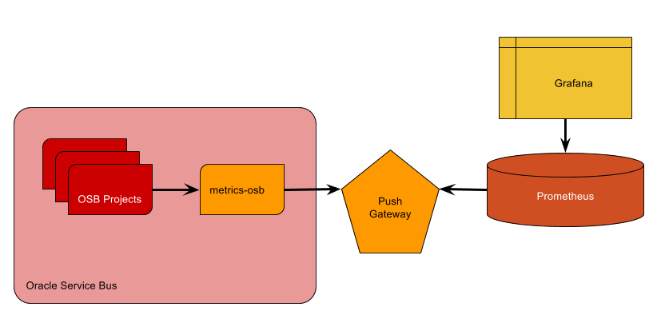
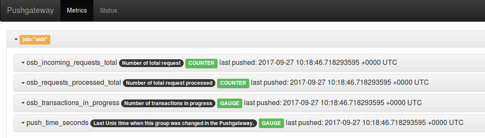
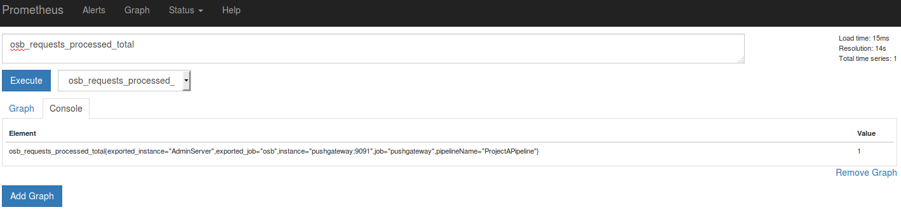
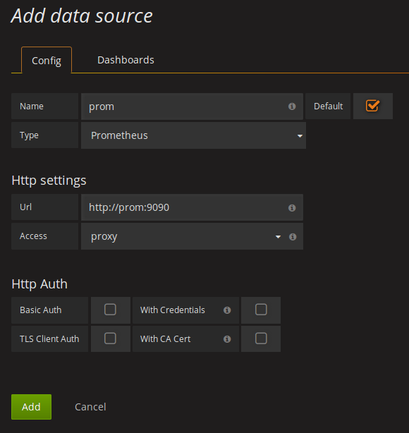
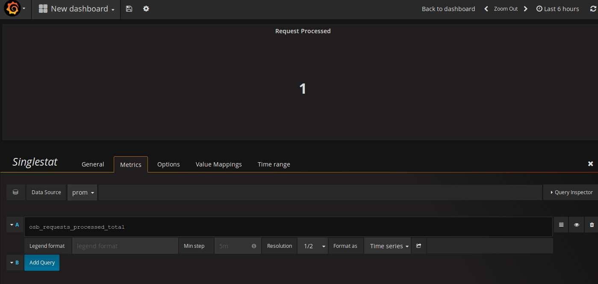

# APM: Metrics for Oracle Fusion Middleware #

This project is aimed to develop the required components to instrument
Oracle Fusion Middleware projects to use SYSCO Middleware's Metrics
platform based on open-source software.

## Architecture ##

### Components ###

#### metrics-helper ####

Java project aimed to be consumed from OSB Java
Callouts to send metrics to a Prometheus Gateway.

Currently we support 2 types of metrics:

* Counter: counters are incremental values. We can used to count
the total number of requests for instance.

* Gauge: gauge values can increment and decrement. This is helpful
when we want to know values that can change, for instance running
instances.

#### metrics-xml-schema ####

Projects with Metric XSD.

#### metrics-osb ####

OSB Project with XSD and Java Callouts incorporated and
with Proxies and XQuery to be consumed by Publish tasks asynchronously.

### Technologies ###

#### Prometheus (https://prometheus.io/) ####

Prometheus is a time-series metrics database. It is based on a poll
approach, so it needs to be configured to scrape metrics from endpoints.
Prometheus also supports alerts.

#### Prometheus Push Gateway (https://prometheus.io/docs/instrumenting/pushing/) ####

In cases where we have job-like programs or platforms that cannot be
customized to expose metrics, Push Gateway can be used to work as
an intermediate step where metrics will be exposed for Prometheus
to scrape from.

#### Grafana (https://grafana.com/) ####

Grafana is a dashboard tool that help to design and publish monitoring
dashboards.



## Deployment

### Local

The easiest way to deploy it locally is to use docker containers.

The `osb` container relies on `oracle/soa:12.2.1.2-quickstart`
image that could be build from https://github.com/sysco-middleware/docker-images

A docker-compose file is prepared to start all the components:

```yaml
version: '2'
services:
  osb:
    build: osb
    ports:
      - 8001:8001
    environment:
      - PUSH_GATEWAY_SERVER=pushgateway:9091
  pushgateway:
    image: prom/pushgateway
    ports:
      - 9091:9091
  prom:
    build: prometheus
    ports:
      - 9090:9090
  grafana:
    image: grafana/grafana
    ports:
      - 3000:3000
```

Running `docker-compose up -d` will build and execute the containers on
your Docker host.

With `docker-compose ps` check that all containers are running:

```
           Name                          Command               State                     Ports
-----------------------------------------------------------------------------------------------------------------
apmmetricsfmw_grafana_1       /run.sh                          Up      0.0.0.0:3000->3000/tcp
apmmetricsfmw_osb_1           startWebLogic.sh                 Up      5556/tcp, 7001/tcp, 0.0.0.0:8002->8001/tcp
apmmetricsfmw_prom_1          /bin/prometheus -config.fi ...   Up      0.0.0.0:9090->9090/tcp
apmmetricsfmw_pushgateway_1   /bin/pushgateway                 Up      0.0.0.0:9091->9091/tcp
```

And with `docker-compose logs osb` check that OSB is up and running:

```
osb_1          | <Sep 27, 2017 9:31:47 AM UTC> <Notice> <WebLogicServer> <BEA-000365> <Server state changed to RUNNING.>
```

Then you are able to deploy the osb projects to test metrics:

First, build the project:

```
./mvnw clean package -Psysco
```

Then open OSB console (http://$(DOCKER-HOST):8001/servicebus/faces/resources) and import projects

* metrics-osb: osb/osb-application/metrics-osb
* example-project-a: osb/osb-application/example-project-a
* example-project-b: osb/osb-application/example-project-b

The use case is simple:

`project-a` will create a couple of metrics:

* counters: incoming-requests and requests-processed
* gauge: transactions in progress

`project-b` will decrease the gauge.

If you go to:

* http://$(DOCKER-HOST):9091 you will check the current metric value.



* http://$(DOCKER-HOST):9090 you will be able to query and execute
calculations on top of the metric values.



Finally:

* http://$(DOCKER-HOST):3000 to access grafana with admin/secret

Register prometheus as a data source:



And create a sample dashboard:

