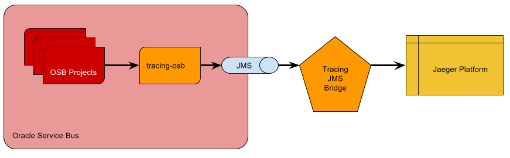
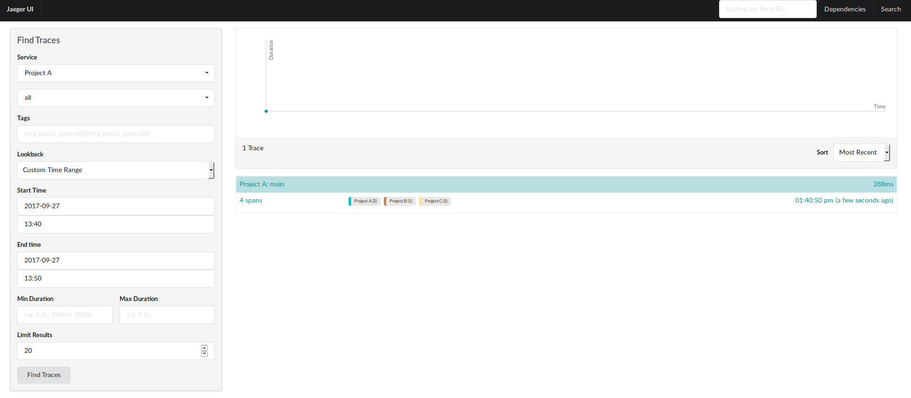
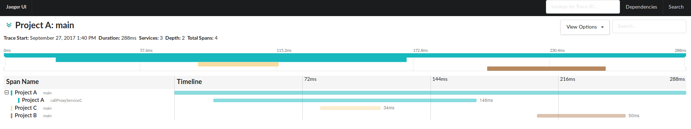

# APM: Tracing for Oracle Fusion Middleware #

This project is aimed to develop the required components to instrument
Oracle Fusion Middleware projects to use SYSCO Middleware's Tracing
platform based on open-source software.

## Architecture ##

In a distributed trace there are some terminology to understand:

From Jaeger documentation: http://jaeger.readthedocs.io/en/latest/architecture/

---
A Span represents a logical unit of work in the system that has an
operation name, the start time of the operation, and the duration.
Spans may be nested and ordered to model causal relationships.
An RPC call is an example of a span.
---
---
A Trace is a data/execution path through the system, and can be
thought of as a directed acyclic graph of spans
---


### Components ###

#### jms-bridge ####

Java project aimed integrate JMS queues with Tracing Platform.

#### trace-xml-schema ####

Projects with Trace XSD.

#### tracing-osb ####

OSB Project with XSD and Transformations incorporated and
with Proxies and XQuery to be consumed by Publish tasks asynchronously.

### Technologies ###

#### OpenTracing API ####

http://opentracing.io/

It is a vendor neutral API that standardize a way to integrate distributed
tracing as part of your application.

#### Jaeger ####

Jaeger is an project open-sourced by Uber, that implements OpenTracing API
and offers a platform to store and visualize distributed traces.


And the integrated architecture would look like this:



## Deployment

### Local

The easiest way to deploy it locally is to use docker containers.

The `osb` container relies on `oracle/soa:12.2.1.2-quickstart`
image that could be build from https://github.com/sysco-middleware/docker-images

A docker-compose file is prepared to start all the components:

```
version: '3.1'
services:
  jaeger:
    image: jaegertracing/all-in-one:latest
    ports:
      - 6831:6831/udp
      - 16686:16686
  tracer:
    image: syscomiddleware/tracing-jms-bridge:0.0.1-SNAPSHOT
    environment:
      - TRACER_WEBLOGIC_URL=t3://osb:8001
  osb:
    build: osb
    ports:
      - 8001:8001
```

First time you start it with `docker-compose up -d` it will build the
osb container and started.

Once it is running:

```
docker-compose logs osb
...
osb_1          | <Sep 27, 2017 9:31:47 AM UTC> <Notice> <WebLogicServer> <BEA-000365> <Server state changed to RUNNING.>
```

You can execute the script to create the JMS queues:

Copy the code from `osb/wlst_script.py`

And execute: `docker-compose exec osb bash`

```
> wlst
> (paste script source)
> (enter)
> (ctrl+c)
> exit
```

Now that your OSB is prepared, you can start the tracer: `docker-compose up -d tracer`

And all containers should be up and running:

```
jeqo:apm-tracing-fmw$ docker-compose ps
         Name                       Command               State                                             Ports
-----------------------------------------------------------------------------------------------------------------------------------------------------------
apmtracingfmw_jaeger_1   /go/bin/standalone-linux - ...   Up      14268/tcp, 0.0.0.0:16686->16686/tcp, 5775/udp, 5778/tcp, 0.0.0.0:6831->6831/udp, 6832/udp
apmtracingfmw_osb_1      startWebLogic.sh                 Up      5556/tcp, 7001/tcp, 0.0.0.0:8001->8001/tcp
apmtracingfmw_tracer_1   /bin/sh -c java -jar /usr/ ...   Up
```

Once everything is running we can deploy `tracing-osb` and sample projects:

Build projects: `./mvnw clean package -Psysco`

And import projects from OSB console

* tracing-osb

* example-project-a

* example-project-b

* example-project-c

And test project A pipeline:



And the detail:



Here we can see a complete trace of 3 projects.